# Data Discovery Tool

> Интеллектуальный инструмент для поиска данных в различных источниках с MCP-интерфейсом для AI-агентов

[](https://www.python.org/)
[](https://fastapi.tiangolo.com/)
[](https://opensource.org/licenses/MIT)

**Data Discovery Tool** — это сервис, который позволяет быстро находить данные в разных источниках (SQLite, CSV) по ключевым словам. Сервис индексирует структуру данных и предоставляет удобный поиск через **три интерфейса**:

- **CLI** — командная строка
- **Web UI** — веб-интерфейс на Streamlit
- **MCP Server** — REST API для AI-агентов

## Установка и запуск

### 1. Склонируйте репозиторий:
```powershell```
git clone https://github.com/vodavafrike/data-discovery-tool.git

cd data-discovery-tool

### 2. Cоздайте виртуальное окружение:
python -m venv venv

### 3. Активируйте его:
.\venv\bin\activate или .\venv\Scripts\activate

### 4. Установите зависимости:
python -m pip install -r requirements.txt

### 5. Загрузите демонстрационные данные:
Данные загружаются автоматически при первом запуске!
При первом запуске в папке data/ появятся:
sample_data/customers.csv
sample_data/orders.csv
sample.db (SQLite)

### 6. Запустите сервис:
### Режим CLI (командная строка):
python main.py --mode cli
### Web UI (Streamlit):
streamlit run web_app.py
### MCP Server (API для AI-агентов):
python server.py


## Скриншоты

### Запуск проекта
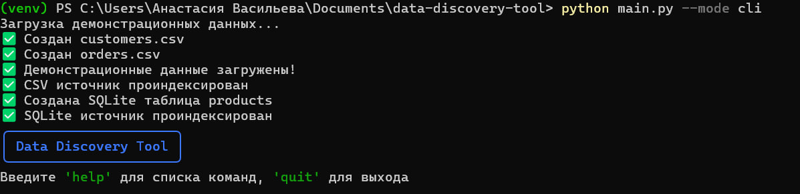

### Список источников данных
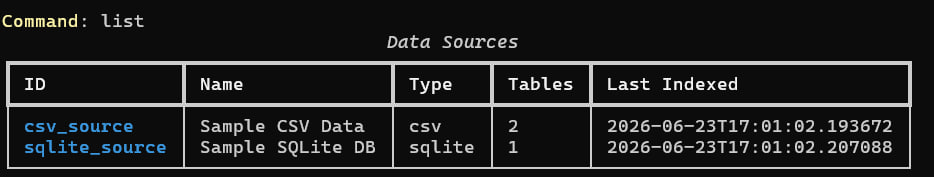

### Поиск по ключевому слову
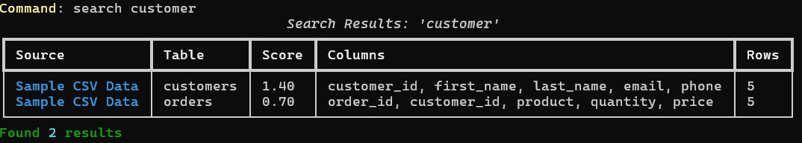

### Схема таблицы
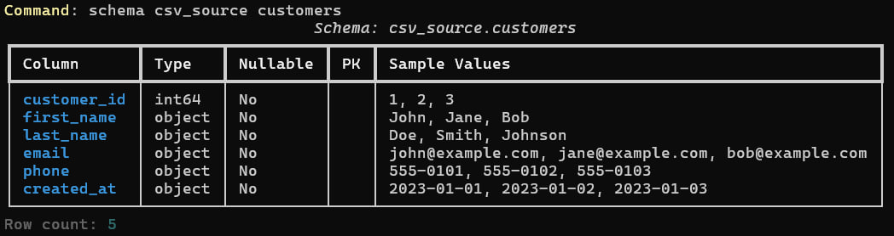

### Статистика


### Особенности

- **Подключение к разным источникам**: SQLite, CSV файлы
- **Индексация метаданных**: таблицы, колонки, типы данных
- **Умный поиск**: с релевантностью и нечетким поиском
- **MCP-интерфейс**: для интеграции с AI-агентами
- **CLI и API**: удобный интерфейс для пользователей
- **Примеры данных**: автоматическая загрузка тестовых данных

### Архитектура
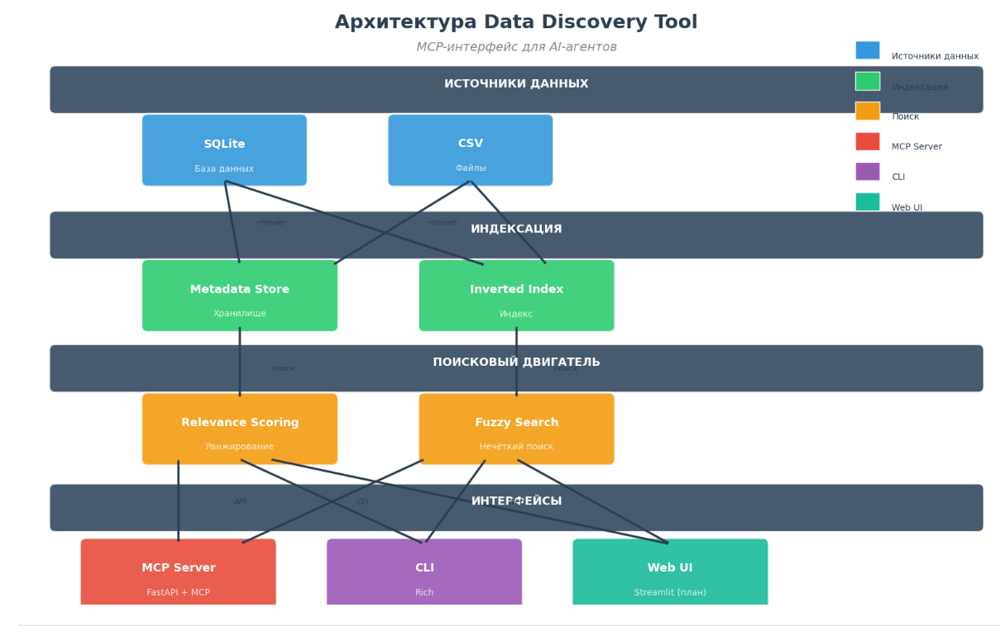

## Веб-интерфейс

### Главная страница
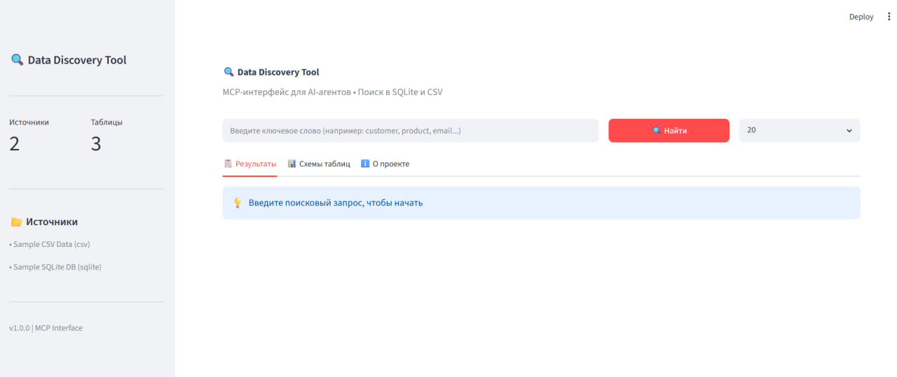

### Результаты поиска
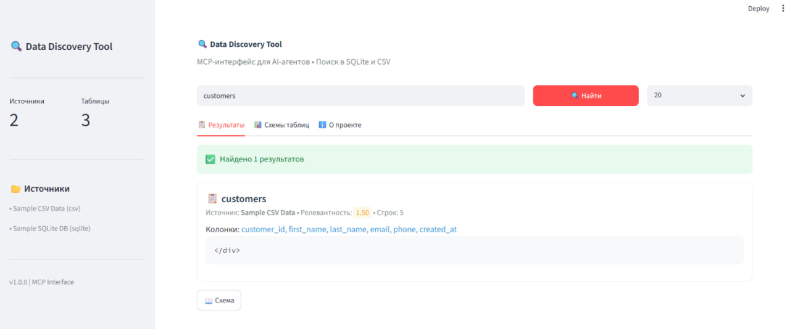

### Схема таблицы
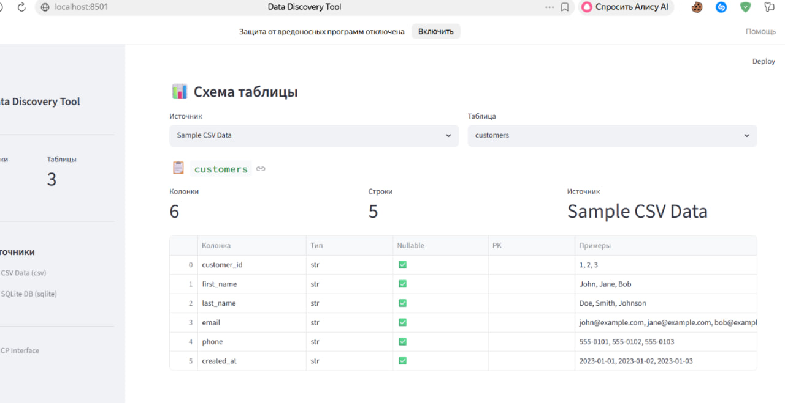

## MCP Server (API для AI-агентов)

MCP сервер предоставляет REST API для AI-агентов, позволяя им выполнять поиск данных программно.

### Документация API (Swagger UI)

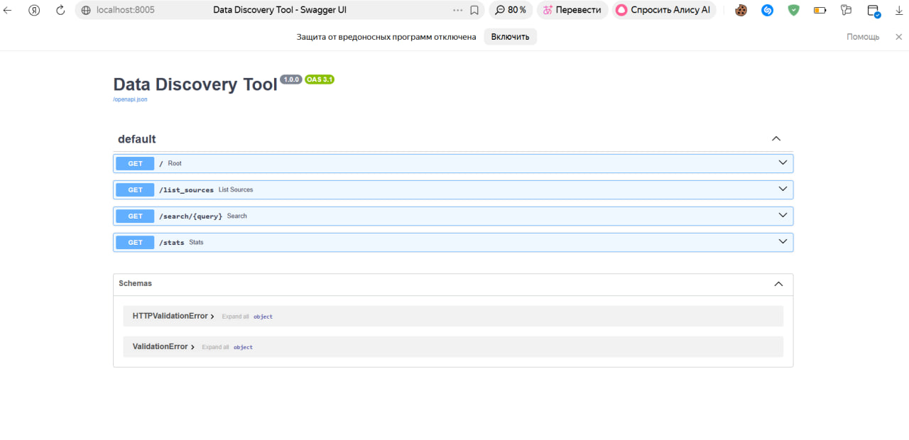

### Список источников данных

Запрос: `GET /list_sources`

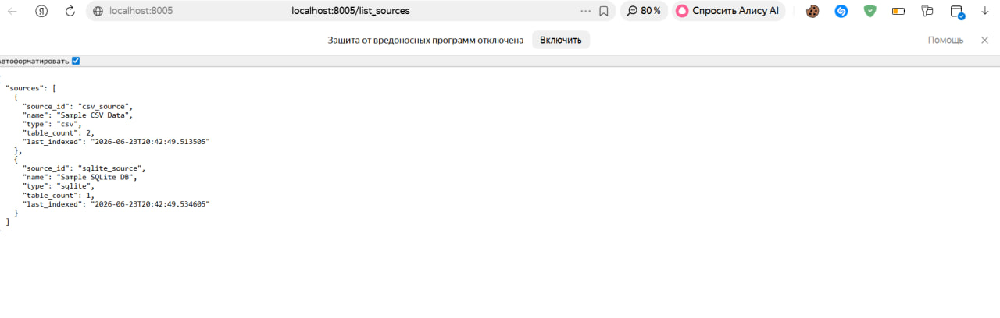

### Поиск по ключевому слову

Запрос: `GET /search/{query}`

Пример: `GET /search/customer`

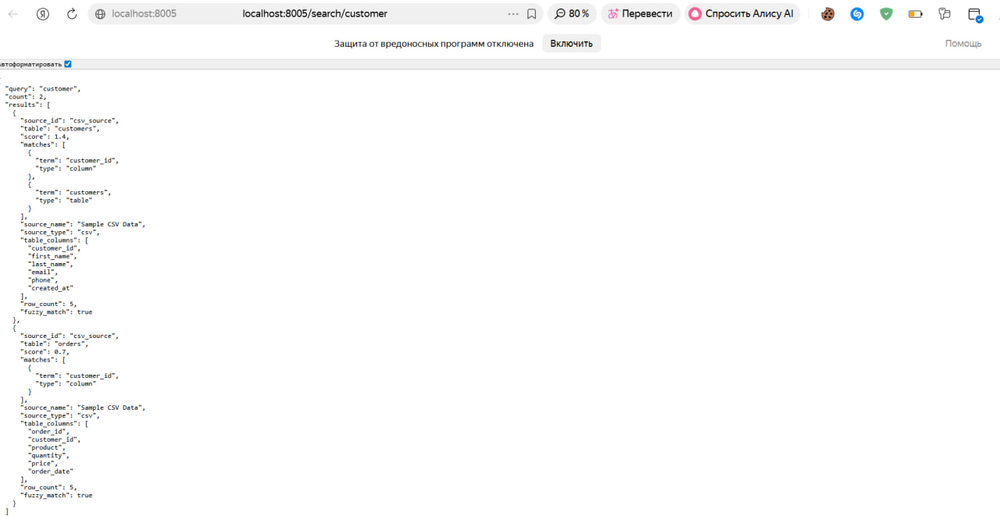

### Статистика

Запрос: `GET /stats`

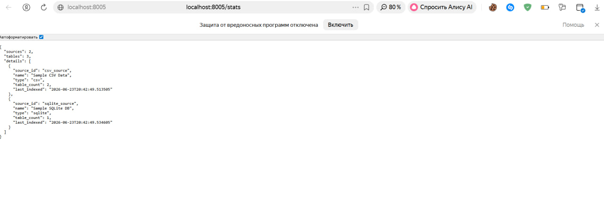
